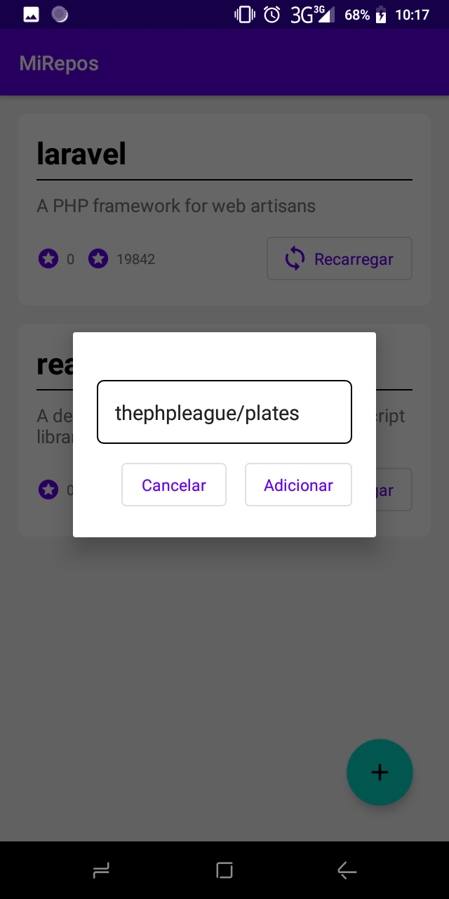
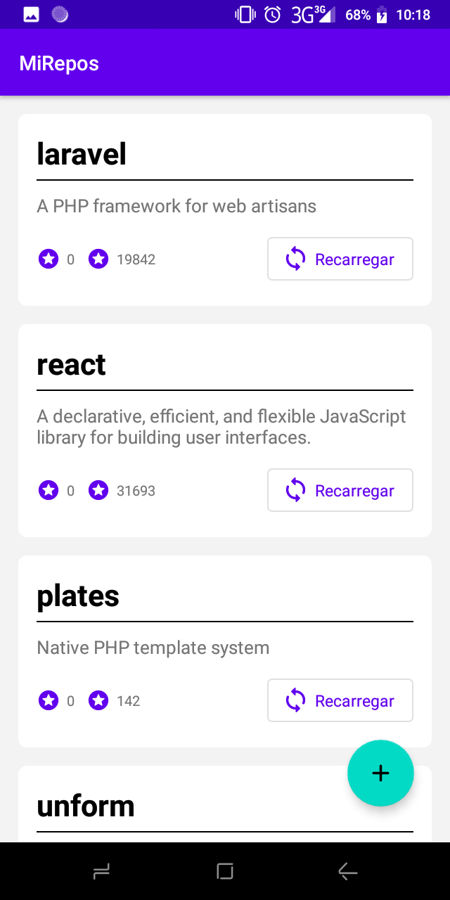

# mi-repos
List of github repos

An application to save your favorite github repositories and track your updates

<h4 align="center">
	🚧  Under development🚀...  🚧
</h4>

## :card_index: Layout

<div style="display: flex; flex-direction: column">
<div>
  
</div>

<div>

</div>
</div>

## :construction_worker: Installation

You will need to install

- [Android Studio](https://developer.android.com/studio?hl=es)

## Running the Project

```bash
$ git clone https://github.com/EuclidesQuissembe/mi-repos # Clone this repository to your machine
$ cd mi-repos # Enter in the project folder
```

## :bulb: Contributing

Pull requests are welcome. For major changes, please open an issue first to discuss what you would like to change.

Please make sure to update tests as appropriate.

### Requisites
You must be aware of

- [Kotlin](https://kotlinlang.org/)

- [Kotlin Coroutines](https://kotlinlang.org/docs/reference/coroutines-overview.html)

- [Room Database](https://developer.android.com/topic/libraries/architecture/room)

- Lifecycle ([LiveData](https://developer.android.com/topic/libraries/architecture/livedata) and [ViewModel](https://developer.android.com/topic/libraries/architecture/viewmodel))

- [Architecture Components](https://developer.android.com/topic/libraries/architecture)


## :bookmark: License

[MIT](https://choosealicense.com/licenses/mit/)
